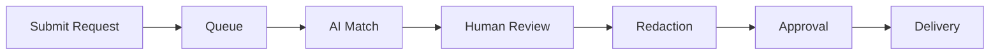
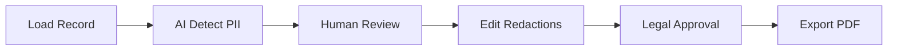
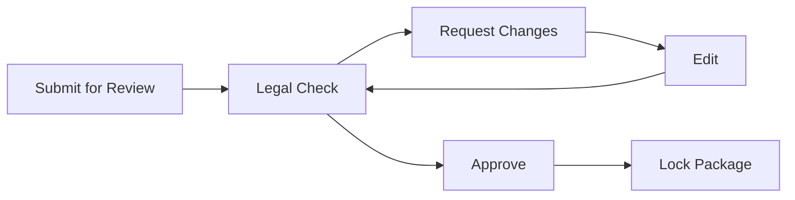

# System Patterns - Public Records AI Assistant

## Architecture Overview

```
[Public Portal (Next.js + MUI)] --Cloud CDN--> [Frontend on Cloud Run] --IAP--> [Backend APIs on Cloud Run]
                                                                     |-> Pub/Sub (async jobs)
                                                                     |-> Cloud Tasks (scheduled sends)
                                                                     |-> Firestore/Cloud SQL
                                                                     |-> Cloud Storage
                                                                     |-> Vertex AI Services
                                                                     |-> BigQuery (audit)
```

## Core Design Patterns

### 1. Frontend Patterns

- **Component Architecture**
  - MUI base components with consistent theming
  - Custom theme with design tokens
  - Responsive, mobile-first design
  - Accessibility-first development

- **State Management**
  - React Hook Form for form state management
  - URL-based filters for shareable views
  - Firebase/Firestore for persistent data

- **Code Quality Patterns**
  - Prettier for consistent code formatting
  - ESLint with automatic import sorting
  - Logical import grouping (External → Internal → Relative)
  - Automated code quality enforcement (9.5/10 score)

- **Data Grid Patterns**
  - MUI Data Grid for lists
  - Server-side pagination
  - Column filters
  - Row-level RBAC

### 2. Backend Patterns

- **API Design**
  - REST endpoints for CRUD
  - GraphQL for complex queries
  - JWT-based authentication
  - Agency-scoped authorization

- **Storage Patterns**
  - Firestore for prototype data
  - Cloud Storage for files
  - BigQuery for audit logs
  - Vertex AI for embeddings

- **Processing Patterns**
  - Pub/Sub for async jobs
  - Cloud Tasks for scheduling
  - Human review gates
  - Versioned artifacts

### 3. Security Patterns

- **Authentication**
  - Google Identity Platform
  - Identity-Aware Proxy
  - Role-based access
  - Multi-factor auth

- **Data Protection**
  - End-to-end encryption
  - us-west region only
  - PII detection
  - Audit logging

## Common Workflows

### 1. Request Processing



### 2. Redaction Flow



### 3. Approval Process



## File Structure

```
src/
  components/
    common/       # Shared components
    forms/        # Form components
    layout/       # Layout components
    viewer/       # PDF viewer
  pages/          # Next.js pages
  hooks/          # Custom hooks
  utils/          # Utilities
  services/       # API services
  styles/         # Theme & styles
  types/          # TypeScript types
```

## Common Interfaces

### 1. Request Interface

```typescript
interface Request {
  id: string;
  agencyId: string;
  status: RequestStatus;
  requesterInfo: RequesterInfo;
  description: string;
  receivedAt: Date;
  dueAt: Date;
  attachments?: Attachment[];
}
```

### 2. Record Interface

```typescript
interface Record {
  id: string;
  agencyId: string;
  title: string;
  mimeType: string;
  sourceSystem: string;
  sensitivity: string;
  storageUri: string;
  metadata: RecordMetadata;
}
```

### 3. Redaction Interface

```typescript
interface Redaction {
  id: string;
  recordId: string;
  version: number;
  findings: PIIFinding[];
  status: RedactionStatus;
  approvalStatus: ApprovalStatus;
}
```

## State Management

### 1. URL State

- Filters
- Sorting
- Page numbers
- Selected items

### 2. Server State

- Request data
- Record data
- User preferences
- Agency context

### 3. Form State

- Validation rules
- Error handling
- Field dependencies
- Submit handling

## Error Handling

- Client validation
- API error responses
- Retry mechanisms
- Error boundaries
- Error logging

## Performance Patterns

- CDN caching
- Image optimization
- Code splitting
- Virtual scrolling
- Lazy loading
